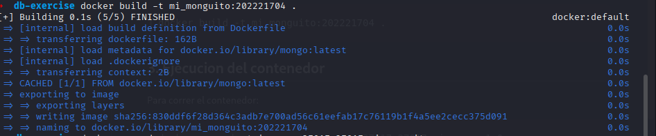
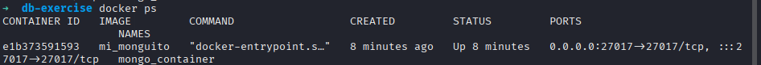

# Tarea: Docker + MongoDB

Este proyecto muestra cómo crear una **imagen personalizada de MongoDB** con inicialización de datos usando **Python y PyMongo**, y cómo probarla desde un script en Flask.

## 1. Estructura del proyecto

- **Dockerfile** Contiene la definición de la imagen personalizada de MongoDB.
- **init.py** Script de inicialización que inserta datos en la base.

## 2. Construcción de la imagen Docker

El archivo [Dockerfile](./Dockerfile) contiene como variables de entorno las credenciales con las que vamos a ingresar a la base de datos y a la base de datos a la que vamos a ingresar

Dentro de la carpeta del proyecto se ejecuto:

```bash
docker build -t mi_monguito:202221704 .
```



## 3. Ejecucion del contenedor

Creamos el contenedor utilizando la imagen que construimos y mapeando este al puerto **27017**

Para correr el contenedor:

```bash
docker run -d --name cont_mongo -p 27017:27017 mi_monguito:202221704
```



## 4. Test de conexion en Python

Para realizar la prueba con el script en python se requieren las siguientes librerías:

- **Flask** Framework web
- **pymongo** Cliente para conectarse a MongoDB.

### 4.1 Ejecucion del test

Una vez tenemos el contenedor arriba, ejecutamos el script de prueba [init.py](./init.py) y probamos el endpoint en el navegador con localhost en el puerto 3000
